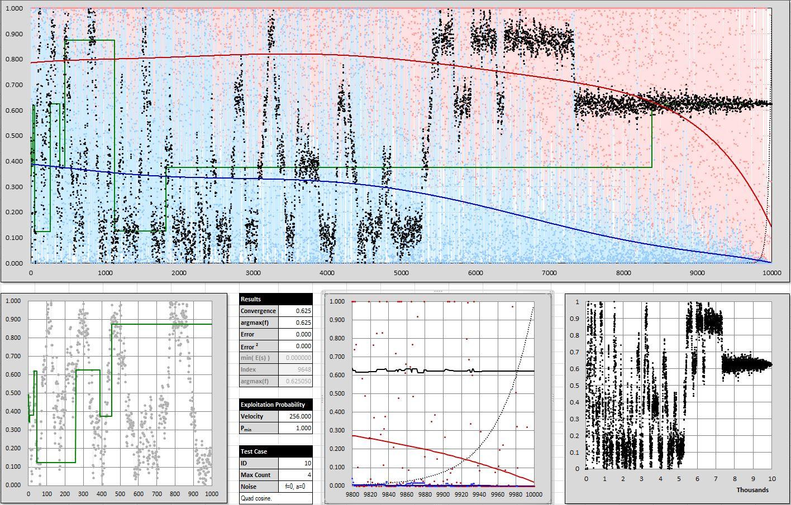

# Simulated Annealing Optimizer

<p align="left">
  
      
</p>

<p align="center">
  
</p>

A compact, dependency-free C++ implementation of **simulated annealing** for continuous function optimization. It minimizes a scalar cost function using the Metropolis acceptance criterion, with a non-standard *late-exploitation* extension that spends the tail of the schedule, refining the best solution found so far. 

The optimizer is tested using a one-dimensional sum-of-sines demo objective, and is structured so you can drop in your own objective function by deriving from a small `Solution` base class.

## 📑 Table of Contents

- [📖 Overview](#-overview)
- [✨ Features](#-features)
- [🧠 How It Works](#-how-it-works)
- [📂 Project Structure](#-project-structure)
- [🔧 Building](#-building)
- [🚀 Running](#-running)
- [🔩 Configuration](#-configuration)
- [📊 Output](#-output)
- [🧩 Extending](#-extending)
- [📄 License](#-license)

## 📖 Overview

Simulated annealing is a metaheuristic for global optimization inspired by the controlled cooling of a metal: early on, the system is "hot" and freely accepts worse candidate solutions in order to explore the search space; as it "cools", it becomes increasingly selective and settles into a low-energy (low-cost) state. This makes it well suited to rough, multi-modal cost landscapes where greedy descent would get stuck in a local optimum.

## ✨ Features

- 🔥 **Classic simulated annealing** with the Metropolis acceptance rule $\exp(-\Delta E / T)$.
- 🌡️ **Two-stage temperature schedule** — a linear cooling curve passed through an exponential *insulated-temperature* transform that controls the candidate search radius and prevents runaway energy transfer.
- 🎯 **Late-exploitation extension** — a non-standard refinement phase whose probability rises as the run cools, devoting the final iterations to polishing the incumbent best solution.
- ⏱️ **Time-budgeted runs** — the optimizer runs for a wall-clock duration (default 10 minutes) rather than a fixed iteration count, with a live console heartbeat and ETA.
- 📊 **Analysis-ready output** — every run writes a CSV trace and a log file you can plot or post-process offline.
- 🧩 **Pluggable objective** — supply your own cost function by deriving from the `Solution` base class.
- 📦 **Zero dependencies** — standard C++ and the STL only; no third-party libraries.

## 🧠 How It Works

The optimizer searches for the value of a hypothesis $x$ (a real number in the range $[0, 1]$ in the demo) that minimizes a cost function. The demo objective in `test_function.cpp` builds a target signal $f(t)$ from a sum of $n = 4$ sine waves — each with its own amplitude $A_i$, frequency $\nu_i$, and phase $\phi_i$ — and defines the cost so that minimizing it is equivalent to maximizing the signal:

$$
g(t) = \sum_{i=1}^{n} A_i \sin\!\big(\nu_i\,(t + \phi_i)\big),
\qquad
f(t) = \frac{1}{2}\!\left(1 + \frac{g(t)}{n}\right),
\qquad
c(x) = 1 - f(t),
$$

where the hypothesis $x \in [0, 1]$ is mapped to the wave argument by $t = 2\pi x$.

Each iteration of the main loop in `optimize()` performs the following steps:

1. **Schedule the temperature.** Progress $k$ is the fraction of the time budget elapsed. The base temperature follows a linear schedule $T(k) = 1 - k$. This is then passed through the *insulated temperature* transform $T_{\text{ins}} = T_{\min} + T_{\text{scale}}\,\exp\!\big((T - 1)/v\big)$, which sets how far a candidate may move from the current solution. A slower cooling velocity $v$ keeps the system hot for longer, searching more widely before it converges.
2. **Generate a candidate.** The current hypothesis is perturbed by a uniform random step drawn from $\pm T_{\text{ins}}$, reflected back into $[0, 1]$ at the bounds. Hotter temperatures produce larger exploratory moves; cooler ones produce fine local adjustments.
3. **Evaluate and accept.** The candidate's energy (its cost) is compared with the current solution's. If the candidate is better it is always accepted; otherwise it is accepted with the Metropolis probability $\exp(-\Delta E / T)$. Whenever a new global best is found, it is recorded and logged.
4. **Exploit late in the run.** If a candidate is rejected, the algorithm may instead snap back to the best solution found so far with probability $p = p_{\max} \cdot \exp\!\big(v\,(k - 1)\big)$. This probability is negligible early on and approaches $p_{\max}$ as the run cools — concentrating late effort on refining the incumbent.

When the time budget is exhausted, the optimizer guarantees the returned solution is the best one seen, and flushes the final result to the CSV and log files.

## 📂 Project Structure

```
simulated-annealing-optimizer/
├─ trainer.sln                    Visual Studio solution
│
├─ trainer/                       The trainer project (C++ sources + VS project files)
│  ├─ main.cpp                    Entry point; constructs and runs the engine
│  ├─ training_engine.cpp         Simulated-annealing engine (the algorithm)
│  ├─ training_engine.h           TrainingEngine class declaration
│  ├─ solution.cpp                Solution base class
│  ├─ solution.h                  Objective-function interface (compute_cost)
│  ├─ test_function.cpp           Demo objective: a sum-of-sines wave function
│  ├─ test_function.h             TestFunction declaration
│  ├─ console_application.cpp     G-CAP console-app framework
│  ├─ console_application.h       ConsoleApplication base class
│  ├─ static_utility.cpp          Timing / formatting helpers
│  ├─ static_utility.h            StaticUtility declarations
│  ├─ stdafx.h / stdafx.cpp       Precompiled-header support
│  ├─ targetver.h                 Windows SDK target version
│  ├─ trainer.vcxproj             Visual Studio C++ project (v145 toolset)
│  └─ trainer.vcxproj.filters     Solution Explorer grouping
│
├─ README.md                      This file
│
└─ LICENSE                        MIT licence
```

## 🔧 Building

**Prerequisites**

- Windows with **Visual Studio** (the *Desktop development with C++* workload). The project targets the **v145** platform toolset and builds cleanly with current Visual Studio releases.
- The build targets the **Win32 (x86)** platform.

**Build from the command line** (Developer Command Prompt / PowerShell, from the repository root):

```bash
msbuild trainer.sln /p:Configuration=Debug /p:Platform=Win32
```

**Or build in the IDE:** open `trainer.sln` in Visual Studio, select the **Debug | Win32** configuration, and build the solution (`Ctrl+Shift+B`).

A successful build produces `Debug\trainer.exe`.

## 🚀 Running

Run the executable from the repository root so its output files land where you expect:

```bash
Debug\trainer.exe
```

With no command-line arguments, the program prints its banner, runs the optimizer for the configured duration, and streams a heartbeat (elapsed time, iteration count, ETA, and each new best solution) to the console. On completion it pauses before exiting. The CSV trace and log file described below are written to the **current working directory**.

## 🔩 Configuration

The annealing parameters are defined as local variables at the top of `optimize()` in `trainer/training_engine.cpp`. Change a value and rebuild to retune a run:

| Parameter | Default | Role |
|---|---|---|
| `temperature` | `1.0` | Starting temperature of the schedule. |
| `temperature_min` | `0.05` | Floor of the insulated-temperature transform. |
| `temperature_scale` | `0.1` | Energy input / scale of the insulated transform. |
| `cooling_velocity` | `0.2` | Cooling rate — lower searches longer and converges better. |
| `exploitation_velocity` | `256.0` | How sharply the late-exploitation probability ramps up. |
| `exploitation_probability_max` | `1.0` | Ceiling on the late-exploitation probability. |
| `execution_time_*` | `10 min` | Wall-clock run duration (hours / minutes / seconds / ms). |
| `heart_beat_frequency` | `100 ms` | Console / log reporting interval. |

The demo objective itself is configured in `trainer/test_function.cpp`, where the amplitude, frequency, and phase of each of the four sine components are set.

## 📊 Output

Each run writes two files to the working directory (both are cleared at the start of a run):

- **`simulated_annealing_output.csv`** — an iteration trace with the columns `Time`, `P(ex)` (the late-exploitation probability), `S` (the current solution), and `SB` (the best solution so far). This is intended for plotting convergence behaviour.
- **`simulated_annealing.log`** — a human-readable log of timing heartbeats and every improvement to the best solution, recording the timestamp, the optimized value at low and high precision, and an 8-bit quantization of that value.

The same heartbeat and improvement lines are echoed to the console while the program runs.

## 🧩 Extending

To optimize your own objective, derive a class from `Solution` (see `solution.h`) and override `compute_cost()` to return the cost of the current `hypothesis` — the vector of decision variables to be optimized. Then point the engine's `SolutionSE` type alias (in `training_engine.h`) at your new class. The bundled `TestFunction` is exactly such a derived class and is a useful template to copy. The demo uses a single-element hypothesis, but `hypothesis` is a `std::vector<double>`, so the same structure extends to multi-variable problems.

## 📄 License

This project is licensed under the **MIT License** — see the [LICENSE](LICENSE) file for the full text.
